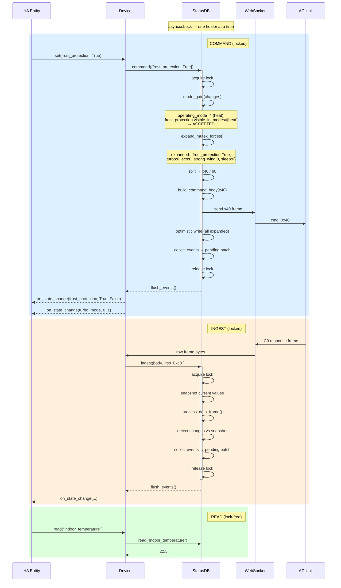
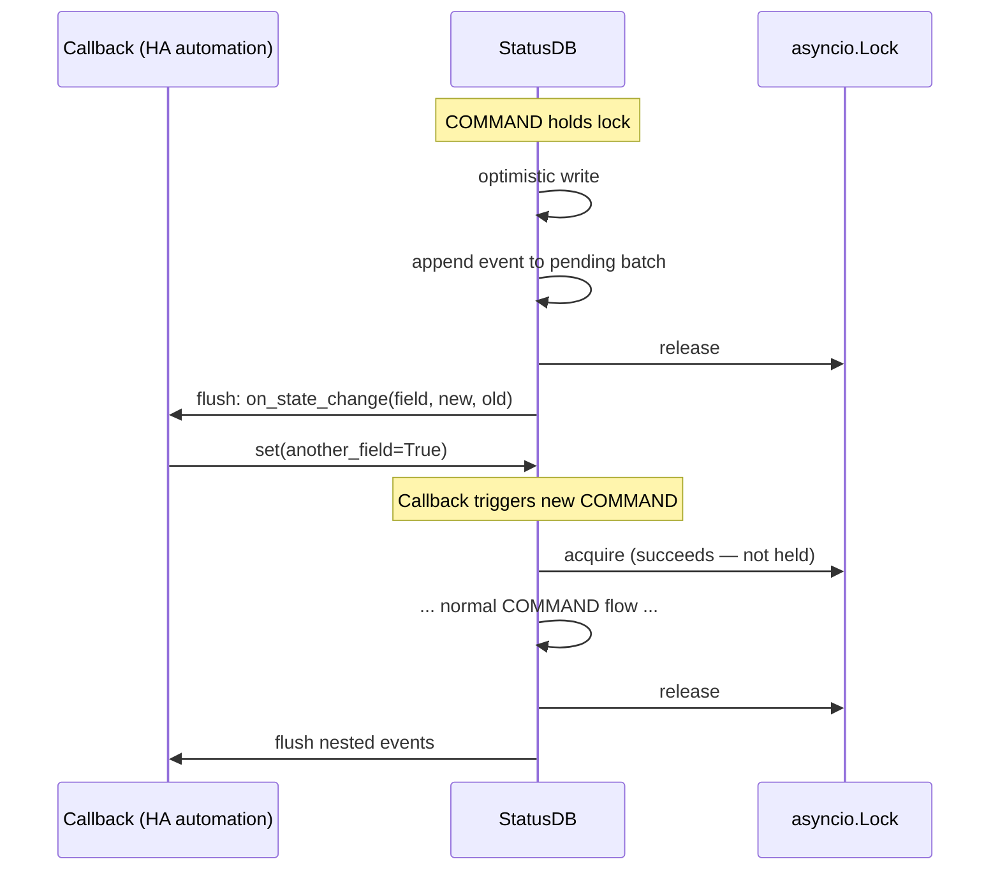
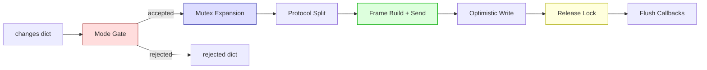
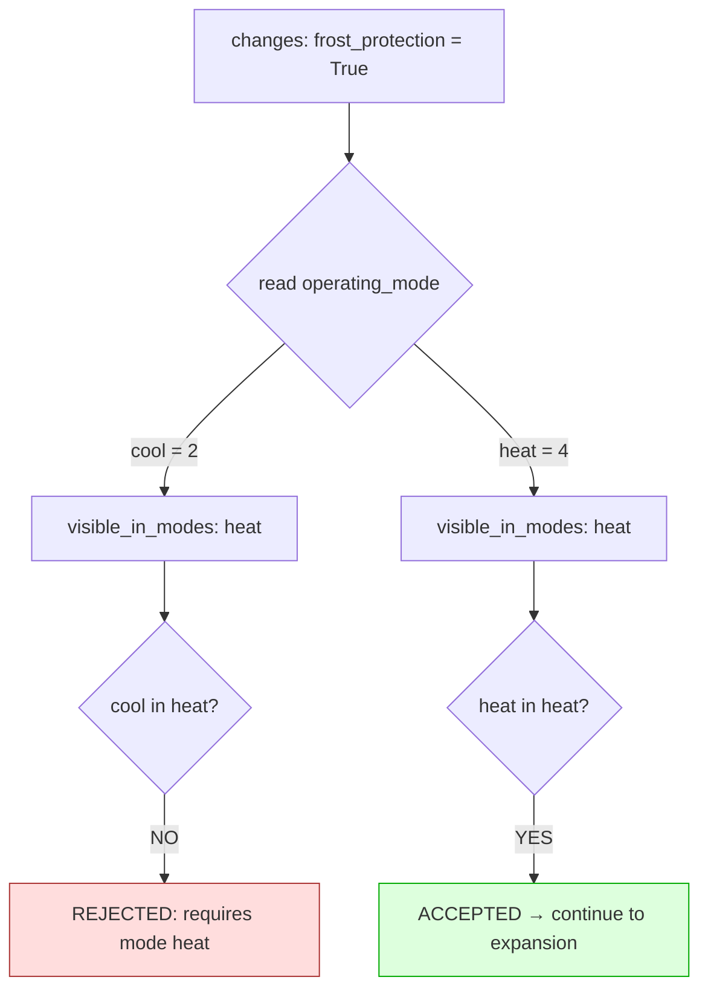
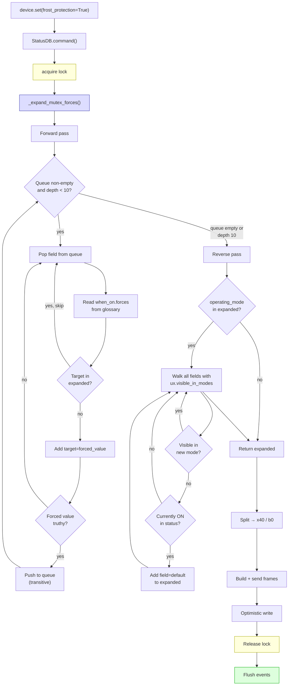
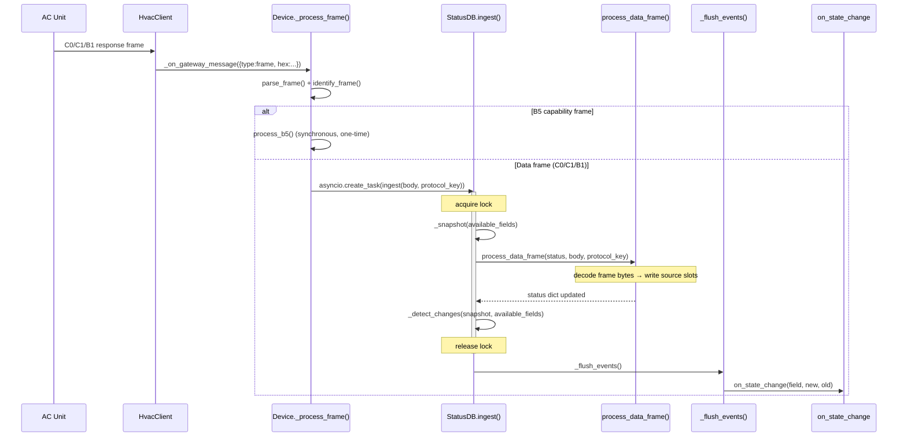

# StatusDB — Atomic State Layer

> Single source of truth for AC field state. Serializes all mutations
> through an `asyncio.Lock`, enforces glossary-driven mutual exclusion,
> and batches state-change events for race-free delivery.

---

## 1. Why StatusDB exists

The Device class manages a status dictionary (`_status`) that holds the
decoded value of every AC field. Multiple concurrent coroutines access it:

- The **listen loop** writes decoded AC responses (INGEST)
- The **command path** reads current state, builds frames, sends them,
  and writes optimistic values (COMMAND)
- **HA entities** and the FM manager read field values at any time (READ)

Without serialization, these operations interleave across `await` points.
A C0 response arriving between two frame sends in a multi-frame command
writes intermediate state and fires callbacks showing a partial update.
Two concurrent `set()` calls read stale siblings for read-modify-write
encoding — the second frame clobbers the first.

StatusDB wraps the raw status dict with an explicit concurrency contract:
writes are serialized, reads are lock-free, and callbacks fire in batches
after the lock is released.

---

## 2. Data model

StatusDB owns the same dict schema produced by `blaueis.core.status.build_status()`:

```
{
  "meta": {
    "device": "unknown",
    "phase": "boot" | "running",
    "glossary_version": "...",
    "b5_received": false,
    "frame_counts": { "rsp_0xc0": 142, ... }
  },
  "fields": {
    "<field_name>": {
      "feature_available": "always" | "readable" | "capability" | "never",
      "data_type": "bool" | "enum" | "uint8" | ...,
      "writable": true | false,
      "sources": {
        "<protocol_key>": {
          "value": <decoded>,
          "raw": <int>,
          "ts": "<ISO 8601>",
          "generation": "new" | "legacy" | null
        },
        "optimistic": { ... }
      },
      "default_priority": ["protocol_all"],
      "active_constraints": { ... } | null,
      "global_constraints": [ ... ]
    }
  },
  "capabilities_raw": [ ... ]
}
```

### 2.1 Source slots and read priority

Each field stores its value in per-frame **source slots**, keyed by the
protocol that last decoded it (`rsp_0xc0`, `rsp_0xc1_sub02`, `rsp_0xb1`,
`optimistic`, etc.). `read_field()` walks a priority list of scopes and
returns the **newest by timestamp** within the first matching scope.

Optimistic values (written after sending a command) live in the
`"optimistic"` slot. When the AC's next real response arrives, it writes
its own slot with a newer timestamp and naturally wins the priority
cascade. No explicit cleanup required — optimistic values fade as fresh
frames arrive.

### 2.2 Lifecycle

```
build_status()     Boot — all fields at glossary defaults, sources empty
     │
     ▼
B5 capability      One-time — process_b5() marks fields available/unavailable,
                   writes active_constraints from capability data
     │
     ▼
Normal operation   INGEST (C0/C1/B1 responses) populates source slots
                   COMMAND (set calls) adds optimistic slots
                   READ returns newest value per priority cascade
```

The status dict **persists across connection drops**. Reconnection
re-establishes the WebSocket but never clears or resets the status.
B5 capabilities are loaded once and never re-queried.

---

## 3. Operation classes

Every access to the status dict falls into one of four classes:

```
┌─────────┬──────────────────────────────────────────────────────────┐
│ Class   │ Description                                              │
├─────────┼──────────────────────────────────────────────────────────┤
│ INGEST  │ AC response → decode → write source slots → detect      │
│         │ changes → batch callbacks                                │
│         │ Caller: listen loop (_process_frame)                      │
│         │ Lock: ACQUIRED                                           │
├─────────┼──────────────────────────────────────────────────────────┤
│ COMMAND │ Read current state → expand mutex → build frame(s) →     │
│         │ send via WebSocket → optimistic write → batch callbacks  │
│         │ Caller: Device.set(), invoked by HA entities / FM        │
│         │ Lock: ACQUIRED                                           │
├─────────┼──────────────────────────────────────────────────────────┤
│ READ    │ Read a field's current value                             │
│         │ Caller: HA entities, FM manager, poll loop, any time     │
│         │ Lock: NOT acquired (lock-free)                           │
├─────────┼──────────────────────────────────────────────────────────┤
│ SHADOW  │ Write/clear Follow Me shadow register                    │
│         │ Caller: FM manager                                       │
│         │ Lock: NOT acquired (separate data, not in _status)       │
└─────────┴──────────────────────────────────────────────────────────┘
```

### 3.1 Conflict matrix

```
          │ INGEST    │ READ      │ COMMAND   │ SHADOW
──────────┼───────────┼───────────┼───────────┼────────
INGEST    │ serial¹   │ safe²     │ CONFLICT  │ safe
READ      │ safe²     │ safe      │ stale³    │ safe
COMMAND   │ CONFLICT  │ stale³    │ CONFLICT  │ safe
SHADOW    │ safe      │ safe      │ safe      │ serial¹

¹ Only one listen loop / FM manager exists — serial by design.
² Lock-free reads between await points see a consistent snapshot.
³ A read may return a value that's about to be overwritten — acceptable.
```

**INGEST vs COMMAND** is the primary conflict. Without serialization:

1. `set()` builds a cmd_0x40 frame using current sibling values
2. A C0 response arrives and overwrites a sibling
3. `set()` sends the frame — now encoding a stale sibling
4. `_apply_optimistic()` writes expected values, but the C0 response
   already fired a callback with an intermediate state

The lock eliminates this: INGEST waits until COMMAND completes (and
vice versa). Both see a consistent snapshot for their entire duration.

### 3.2 Why reads are lock-free

This is single-threaded `asyncio`. Between `await` points, no other
coroutine runs. A `read()` call is synchronous (no `await`) — it
completes within one event-loop tick and always sees a consistent dict.

The lock serializes operations that span multiple `await` points:
frame sends, which yield to the event loop. Reads have no such yield
and need no protection.

A read during a locked COMMAND returns either the pre-command or
post-command value. Both are valid snapshots — there is no "partial
update" visible to a lock-free reader.

---

## 4. Lock protocol



### 4.1 Callback batching

Callbacks fire **after** the lock is released. This prevents deadlocks:



If callbacks fired under the lock, the triggered `set()` would deadlock
trying to acquire the same lock. Batching breaks the cycle.

### 4.2 Event deduplication

Within a single lock hold, multiple writes to the same field may occur
(e.g., INGEST writes `operating_mode=4`, then an immediately following
COMMAND also writes it). The pending batch tracks events as a list of
`(field, new_val, old_val)` tuples. On flush:

1. Merge by field name — keep the **first** `old_val` and **last** `new_val`
2. Drop events where `old_val == new_val` after merging (no net change)
3. Fire surviving events in field order

This ensures each field fires at most one callback per lock cycle,
representing the net state transition.

---

## 5. Command pipeline — mode gate + mutex + frame build

The COMMAND operation runs a multi-step pipeline under a single lock
hold. Each step narrows or augments the caller's changes dict:



### 5.1 Mode gate — reject wrong-mode writes

Before any expansion, the mode gate checks each field's
`ux.visible_in_modes` against the current `operating_mode`. If the
mode is wrong, the field is **rejected** — removed from the pipeline
and returned to the caller in the `rejected` dict.

**Mode is a prerequisite, not a side effect.** Setting
`frost_protection=True` does NOT auto-switch to heat mode. If the AC
is in cool mode, the write is rejected. Automations must set
`operating_mode` first, then presets.



**Effective mode when changing mode:** If `operating_mode` appears in
the same `set()` call, the gate evaluates other fields against the NEW
mode, not the current one — the caller intends to switch.

**Fields without `visible_in_modes`** always pass (power,
target_temperature, fan_speed, etc.).

### 5.2 Forward pass — field ON forces dependencies

When a field is being set to an active value (truthy for bools, non-zero
for enums/numerics), its `mutual_exclusion.when_on.forces` targets are
merged into the expanded changes dict.

**Caller's explicit values always take precedence** — if the caller sets
both `frost_protection=True` and `operating_mode=2`, the expansion does
not overwrite `operating_mode`. The AC firmware is authoritative about
whether the combination takes effect.

**Transitive expansion** via work queue: if a forced value is itself
truthy (e.g., `no_wind_sense` forces `breezeless=1`), the target enters
the queue and its own forces are expanded. A depth cap of 10 prevents
runaway loops from glossary misconfiguration.

### 5.3 Reverse pass — mode change clears incompatible fields

If `operating_mode` appears in the expanded dict (from the caller or from
forward expansion), all fields with `ux.visible_in_modes` excluding the
new mode are checked. Any that are currently ON in the status DB are
added to the expanded dict with their masked default (typically `False`
for bools, `0` for numerics).

This is the runtime equivalent of `build_command_body()`'s UX masking,
but applied to the expanded changes dict so `_apply_optimistic()` sees it.

### 5.4 Expansion algorithm



### 5.5 Protocol frame distribution

Mutex forces targets span two protocol frames:

| Frame | Fields in forces graphs |
|---|---|
| cmd_0x40 | operating_mode, turbo_mode, eco_mode, strong_wind, frost_protection, sleep_mode, swing_vertical, swing_horizontal |
| cmd_0xb0 | jet_cool, breeze_away, breeze_mild, breezeless, no_wind_sense, louver_swing_angle_ud_enum, louver_swing_angle_lr_enum, new_wind_sense |

**Frost protection** forces only x40 targets — single frame, inherently
atomic on the wire.

Cross-frame forces (breeze/jet_cool family) produce both x40 and b0
frames. The StatusDB lock holds across both sends, preventing any
INGEST from interleaving between them. From HA's perspective, the
combined operation is atomic.

### 5.6 Pipeline examples

**Example 1: Frost protection in cool mode — REJECTED by mode gate**
```
Input:    {frost_protection: True}
Mode:     cool (2)
Gate:     frost_protection.visible_in_modes = [heat] → cool not in list
Result:   expanded={}, rejected={frost_protection: "requires mode heat"}
Frames:   none
```

**Example 2: Frost protection in heat mode — accepted + forces**
```
Input:    {frost_protection: True}
Mode:     heat (4)
Gate:     frost_protection.visible_in_modes = [heat] → passes
Forward:  frost_protection.forces →
            turbo_mode: 0, eco_mode: 0, strong_wind: 0, sleep_mode: 0
Expanded: {frost_protection: True, turbo_mode: 0, eco_mode: 0,
           strong_wind: 0, sleep_mode: 0}
Frames:   1x cmd_0x40
```

**Example 3: Mode change heat→cool clears frost_protection**
```
Input:    {operating_mode: 2}
Gate:     operating_mode has no visible_in_modes → passes
Forward:  operating_mode has no when_on.forces → nothing
Reverse:  mode=2 (cool) → frost_protection visible_in_modes:[heat]
            → not visible in cool, currently True → add False
Expanded: {operating_mode: 2, frost_protection: False}
Frames:   1x cmd_0x40
```

**Example 4: Automation — set mode then preset (correct pattern)**
```
Call 1:   device.set(operating_mode=4)
          → optimistic write: DB now says heat
Call 2:   device.set(frost_protection=True)
          → mode gate checks operating_mode=4 (from optimistic) → passes
          → sibling forces applied → frame sent
```

**Example 5: Mode + frost_protection in one call**
```
Input:    {operating_mode: 4, frost_protection: True}
Gate:     effective_mode = 4 (from changes), frost_protection [heat] → passes
Forward:  frost_protection.forces → turbo:0, eco:0, strong_wind:0, sleep:0
Expanded: {operating_mode: 4, frost_protection: True, turbo_mode: 0, ...}
Frames:   1x cmd_0x40
```

**Example 6: Transitive — no_wind_sense ON (in cool mode)**
```
Input:    {no_wind_sense: True}
Mode:     cool (2)
Gate:     no_wind_sense.visible_in_modes = [cool, heat] → passes
Forward:  no_wind_sense.forces →
            eco_mode: 0, strong_wind: 0, turbo_mode: 0,
            swing_vertical: 0, breezeless: 1
          breezeless=1 is truthy → enqueue
          breezeless.forces →
            breeze_away: 0, breeze_mild: 0, turbo_mode: 0 (dup),
            strong_wind: 0 (dup), jet_cool: 0, swing_vertical: 0 (dup),
            swing_horizontal: 0, louver_ud: 0, louver_lr: 0,
            no_wind_sense: 0 (caller set True → skip)
Expanded: 12 fields across x40 + b0
Frames:   1x cmd_0x40 + 1x cmd_0xb0 (under same lock hold)
```

---

## 6. Linked services

### 6.1 Device (owner)

`Device` creates and owns the StatusDB instance. It delegates all
status access through StatusDB's API:

```
Device.__init__()
  └→ self._db = StatusDB(glossary)

Device.set(**changes)
  └→ self._db.command(changes, send_fn=self._client.send_frame)

Device._process_frame(body)
  └→ self._db.ingest(body, protocol_key, timestamp)

Device.read(field_name)
  └→ self._db.read(field_name)

Device.on_state_change
  └→ self._db.on_state_change  (callback passthrough)
```

Device retains ownership of:
- WebSocket connection (`_client`)
- Poll loop and supervisor (read-only access to status for query computation)
- Follow Me shadow register (separate from StatusDB)
- B5 capability discovery (one-time, runs before normal operations)

### 6.2 Poll loop

The poll loop calls `_compute_required_queries()` and
`_build_query_frame()`, both of which read `_status` to determine which
fields need querying and whether the Follow Me shadow is armed.

These are **lock-free reads**. The poll loop sends query frames directly
via `_client.send_frame()` — not through StatusDB. Query frames do not
modify state; the AC's responses arrive via the listen loop and flow
through `ingest()`.

```
_poll_loop()
  └→ _send_poll_queries()
       ├→ _compute_required_queries()   ← lock-free read of _status
       ├→ _build_query_frame(qkey)      ← lock-free read of _status + shadow
       └→ _client.send_frame(frame)     ← direct WS send (no lock)
```

### 6.3 Listen loop

The listen loop receives raw frames from the gateway, parses them, and
routes them to StatusDB for processing:

```
_listen_loop()
  └→ _client.listen()
       └→ _on_gateway_message(msg)
            └→ _process_frame(body)
                 ├→ B5 response → process_b5() (stays on Device, one-time)
                 └→ C0/C1/B1   → self._db.ingest(body, protocol_key, ts)
```

`ingest()` acquires the lock, processes the frame, detects changes, and
flushes callbacks after release.

### 6.4 HA Coordinator

The HA coordinator (`BlaueisMideaCoordinator`) wraps `Device` and
bridges its callbacks to HA's entity system:

```
BlaueisMideaCoordinator
  ├→ self.device = Device(host, port, psk)
  ├→ self.device.on_state_change = self._on_field_change
  └→ _on_field_change(field, new, old)
       └→ fire_entity_callbacks(field)  ← triggers HA entity state writes
```

The coordinator does not access StatusDB directly. It reads field values
via `self.device.read()` and sends commands via `self.device.set()`.
Both go through StatusDB's API.

### 6.5 HA entities

HA entities read state synchronously for property evaluation and send
commands asynchronously via the coordinator:

```
BlaueisMideaClimate.hvac_mode (property)
  └→ self._coord.device.read("operating_mode")    ← lock-free READ

BlaueisMideaClimate.async_set_preset_mode("Frost Protection")
  └→ self._device.set(frost_protection=True, ...)  ← COMMAND via StatusDB
```

Entities never access StatusDB or `_status` directly.

### 6.6 Follow Me manager

The FM manager interacts with Device at two levels:

```
BlauiesFollowMeManager._tick()
  ├→ self._coord.device.set(follow_me=True)          ← COMMAND via StatusDB
  ├→ self._coord.device.set_follow_me_shadow(temp)    ← SHADOW (not StatusDB)
  └→ self._coord.device.read("follow_me")             ← lock-free READ
```

The shadow register (`_follow_me_shadow`) is separate from `_status` and
does not go through the lock. It is read by the poll loop's
`_build_query_frame()` at a single point with no cross-await dependency.

### 6.7 Command builder (`build_command_body`)

The command builder reads `_status` for read-modify-write encoding of
bit-packed bytes. It also applies UX masking (zeroing fields not visible
in the current operating mode).

With StatusDB, the command builder is called **under the lock** inside
`command()`. This guarantees sibling values are consistent for the entire
frame-building operation. The existing preflight check (stale-sibling
detection) provides a secondary safety net.

UX masking in the command builder and mutex expansion in StatusDB are
**belt and suspenders**: expansion adds forced values as explicit changes
(which bypass UX masking), while UX masking handles any remaining
implicit fields. The two layers are compatible and do not conflict.

---

## 7. Call chains — method level

Detailed method-level call chains for each operation class.

### 7.1 COMMAND: `Device.set()` → AC

```mermaid
sequenceDiagram
    participant HA as HA / Automation
    participant Dev as Device.set()
    participant DB as StatusDB.command()
    participant Gate as _apply_mode_gate()
    participant Mutex as _expand_mutex_forces()
    participant Build as build_command_body()
    participant WS as HvacClient.send_frame()
    participant Opt as _apply_optimistic()
    participant Flush as _flush_events()
    participant CB as on_state_change

    HA->>Dev: set(frost_protection=True)
    Dev->>DB: command({frost_protection:True}, send_fn)

    activate DB
    Note over DB: acquire lock

    DB->>Gate: _apply_mode_gate(changes, all_fields)
    Gate-->>DB: (accepted, rejected)

    DB->>Mutex: _expand_mutex_forces(accepted, all_fields)
    Note over Mutex: forward pass: forces<br/>reverse pass: mode compat
    Mutex-->>DB: expanded dict

    DB->>DB: _split_by_protocol(expanded) → x40, b0

    opt x40 fields present
        DB->>Build: build_command_body(status, x40)
        Build-->>DB: {body, preflight}
        opt body not None
            DB->>WS: send_fn(frame.hex())
        end
    end

    opt b0 fields present
        DB->>Build: build_b0_command_body(status, b0)
        Build-->>DB: {body}
        opt body not None
            DB->>WS: send_fn(frame.hex())
        end
    end

    DB->>Opt: _apply_optimistic(expanded)
    Note over Opt: write_field for each changed value<br/>collect pending events

    Note over DB: release lock
    deactivate DB

    DB->>Flush: _flush_events()
    Flush->>CB: on_state_change(field, new, old)
    Note over Flush: deduplicated, outside lock
```

### 7.2 INGEST: AC response → status update



### 7.3 READ: lock-free field access

```mermaid
flowchart LR
    HA["HA Entity / FM Manager"] -->|read()| Dev["Device.read()"]
    Dev -->|read()| DB["StatusDB.read()"]
    DB -->|read_field()| Status["_status dict"]
    Status -->|value| DB
    DB -->|value| Dev
    Dev -->|value| HA

    style DB fill:#dfd,stroke:#0a0
    Note["No lock acquired — synchronous,<br/>consistent within one event-loop tick"]

    style Note fill:#ffe,stroke:#aa0
```

---

## 8. State flow — complete picture

```mermaid
flowchart LR
    subgraph AC["AC Unit"]
        ACU[Indoor Unit]
    end

    subgraph GW["Gateway (Pi)"]
        UART[UART Bridge]
        WSS[WebSocket Server]
    end

    subgraph Client["blaueis-client"]
        WC[HvacClient]
        subgraph Dev["Device"]
            PL[Poll Loop]
            LL[Listen Loop]
            SV[Supervisor]
            FM_S[FM Shadow]
            subgraph SDB["StatusDB"]
                Lock[asyncio.Lock]
                Status[_status dict]
                Mutex[Mutex Expansion]
                Events[Event Batch]
            end
        end
    end

    subgraph HA["Home Assistant"]
        Coord[Coordinator]
        Climate[Climate Entity]
        Switch[Switch Entity]
        Sensor[Sensor Entity]
        FMM[Follow Me Manager]
    end

    ACU <-->|serial frames| UART
    UART <-->|frame relay| WSS
    WSS <-->|WebSocket| WC

    WC -->|raw frame| LL
    LL -->|ingest| SDB
    PL -->|query frame| WC
    PL -.->|read queries| Status
    FM_S -.->|shadow| PL

    Climate -->|set()| Dev
    Switch -->|set()| Dev
    Dev -->|command()| SDB
    SDB -->|send frame| WC

    SDB -->|flush events| Coord
    Coord -->|state_change| Climate
    Coord -->|state_change| Switch
    Coord -->|state_change| Sensor

    Climate -.->|read()| Status
    Switch -.->|read()| Status
    Sensor -.->|read()| Status

    FMM -->|set()| Dev
    FMM -->|shadow| FM_S
    FMM -.->|read()| Status

    style SDB fill:#e8f0fe,stroke:#4285f4
    style Lock fill:#ffd,stroke:#aa0
    style Mutex fill:#ddf,stroke:#33a
    style Events fill:#dfd,stroke:#0a0
```

**Solid lines** = data flow (frames, commands, events).
**Dashed lines** = lock-free reads.

---

## 9. Migration from current Device

### 9.1 What moves into StatusDB

| Current location | StatusDB method |
|---|---|
| `Device._status` | `StatusDB._status` |
| `Device._apply_optimistic()` | `StatusDB._apply_optimistic()` |
| `Device._snapshot_fields()` | `StatusDB._snapshot_fields()` |
| `Device._detect_changes()` | `StatusDB._detect_changes()` |
| Frame building + send in `Device.set()` | `StatusDB.command()` |
| Frame processing in `Device._process_frame()` | `StatusDB.ingest()` |
| `Device.read()` / `read_field()` / `read_all_available()` | `StatusDB.read()` / `read_field()` |

### 9.2 What stays on Device

| Responsibility | Why |
|---|---|
| WebSocket connection (`_client`) | I/O — StatusDB is I/O-agnostic (receives `send_fn`) |
| Poll loop + supervisor | Scheduling — reads status lock-free, sends queries directly |
| Follow Me shadow | Separate register, not part of status dict |
| B5 capability discovery | One-time bootstrap, runs before normal operations |
| Gateway info / stats | Metadata, not field state |
| `on_connected` / `on_disconnected` | Connection lifecycle, not state |

### 9.3 API changes

```python
# Before
device = Device(host, port, psk=psk)
device.on_state_change = callback
await device.set(power=True)
val = device.read("power")

# After — identical external API
device = Device(host, port, psk=psk)
device.on_state_change = callback       # delegates to device._db.on_state_change
await device.set(power=True)            # delegates to device._db.command()
val = device.read("power")              # delegates to device._db.read()
```

The Device public API does not change. StatusDB is an internal
refactoring — all external callers (HA coordinator, FM manager, CLI
tools) continue using `Device.set()`, `Device.read()`, and
`Device.on_state_change`.

---

## 10. Glossary dependency

StatusDB reads two glossary constructs at runtime:

### 10.1 `ux.visible_in_modes` — mode gate

```yaml
frost_protection:
  ux:
    visible_in_modes: [heat]
```

Consumed by the mode gate (`_apply_mode_gate`) as a write fence and by
the reverse pass as a cleanup trigger. The same `is_field_visible()`
function from `blaueis.core.ux_gating` is used in both places and in
the command builder's frame-level UX masking.

Fields with `visible_in_modes`:
| Field | Modes |
|---|---|
| frost_protection | heat |
| jet_cool | cool |
| turbo_mode | cool, heat |
| eco_mode | cool, auto, dry |
| strong_wind | cool, heat, fan_only |
| sleep_mode | cool, heat, dry, auto |
| no_wind_sense | cool, heat |
| breeze_away | cool, heat, fan_only, dry, auto |
| breeze_mild | cool, heat, fan_only, dry, auto |
| breezeless | cool, heat, fan_only, dry, auto |

### 10.2 `mutual_exclusion.when_on.forces` — sibling forces

```yaml
frost_protection:
  mutual_exclusion:
    when_on:
      forces:
        turbo_mode: 0
        eco_mode: 0
        strong_wind: 0
        sleep_mode: 0
```

Consumed by the forward pass of `_expand_mutex_forces()`. Every field
name in the `forces` dict must exist in the glossary. Every forced value
must be valid for the target's data type and domain.

Note: `operating_mode` is intentionally NOT in frost_protection's forces.
Mode switching is handled by the mode gate — frost_protection requires
heat mode as a prerequisite, it does not auto-switch to heat.

### 10.3 No hardcoded field names

The enforcement algorithm contains **no hardcoded field names**. It reads
the glossary generically:
- Mode gate: checks `ux.visible_in_modes` for any field being written
- Forward pass: iterates `when_on.forces` for any field being set to
  an active value
- Reverse pass: iterates all fields with `ux.visible_in_modes` when
  `operating_mode` changes

Adding a new mutual exclusion rule or mode fence requires only a glossary
change. No Python code modifications needed.
